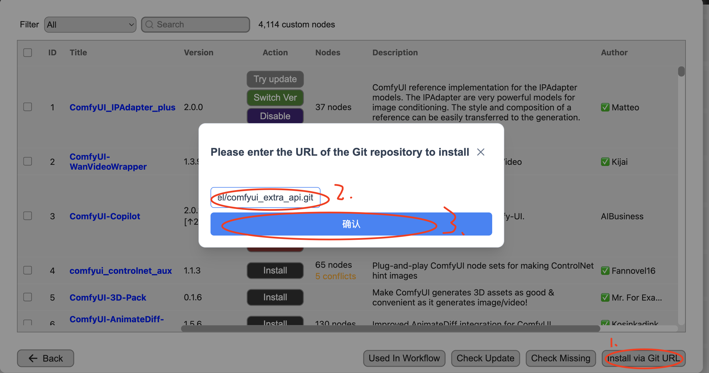
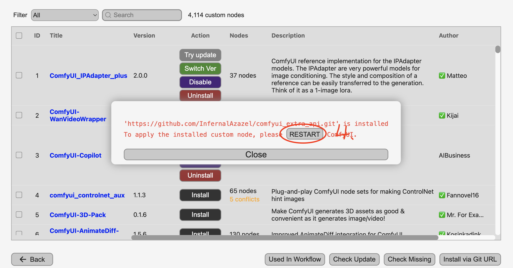

# ComfyUI 额外 API

为 ComfyUI 提供额外的 HTTP 接口，便于查询与管理输入/输出图片等资源。

## 开始使用

### 安装方式一：通过 custom_nodes 克隆
1. 进入 `custom_nodes`
   ```bash
   cd custom_nodes
   ```
2. 克隆仓库并进入目录
   ```bash
   git clone https://github.com/InfernalAzazel/comfyui_extra_api.git
   cd comfyui_extra_api
   ```

### 安装方式二：通过 ComfyUI-Manager
1. 打开设置页面（配置文件路径）：`ComfyUI/user/default/ComfyUI-manager/config.ini`
2. 安装期间临时设置：`security_level = weak`
3. 安装完成后恢复：`security_level = normal`




## 接口

所有接口统一前缀：`/extra-api/v1`

1. `/extra-api/v1/output-images`

   方法：GET

   查询参数：`temp`，true 或 false

   说明：列出所有输出图片；若 `temp` 为 true，则仅列出由 `PreviewImage` 节点生成的临时输出图片。支持的文件扩展名：`.png`、`.jpg`、`.jpeg`、`.webp`、`.gif`。

   请求示例：
   ```bash
   curl -X GET "http://<host>/extra-api/v1/output-images?temp=true"
   ```

   响应示例（成功）：
   ```json
   {
     "code": 200,
     "message": "success",
     "images": [
       { "name": "a.png", "full_path": "/path/to/a.png" }
     ]
   }
   ```

2. `/extra-api/v1/output-images/{filename}`

   方法：DELETE

   查询参数：`temp`，true 或 false

   说明：删除指定文件名的输出图片；若 `temp` 为 true，则仅删除由 `PreviewImage` 节点生成的临时输出图片。

   安全约束：`filename` 不可以 `/` 开头且不可包含 `..`，必须为纯文件名（避免路径穿越）。

   请求示例：
   ```bash
   curl -X DELETE "http://<host>/extra-api/v1/output-images/a.png?temp=false"
   ```

   响应示例（成功）：
   ```json
   { "code": 200, "message": "success" }
   ```

3. `/extra-api/v1/input-images/{filename}`

   方法：DELETE

   查询参数：`temp`，true 或 false

   说明：删除指定文件名的输入图片。

   安全约束：`filename` 不可以 `/` 开头且不可包含 `..`，必须为纯文件名（避免路径穿越）。

   请求示例：
   ```bash
   curl -X DELETE "http://<host>/extra-api/v1/input-images/a.png?temp=false"
   ```

   响应示例（成功）：
   ```json
   { "code": 200, "message": "success" }
   ```

### 公共返回格式
- 成功：`{"code": 200, "message": "success", ...}`
- 失败：`{"code": <int>, "message": <string>, ...}`

## 致谢
- 感谢开源仓库：[injet-zhou/comfyui_extra_api](https://github.com/injet-zhou/comfyui_extra_api.git)

